# VR_KringleCompany
Great Asset, Great Great Asset

## Week 1

### History of VR

#### Sensorama 
It was an early example of immersive, multi-sensory technology developed in the 1960s by filmmaker Morton Heilig. It was one of the first attempts at creating a virtual reality (VR) experience. The Sensorama was essentially a mechanical device resembling an arcade game cabinet that included a stereoscopic **3D display**, **stereo sound**, vibration, and even **scent generators**. Users would sit in front of the machine with their head placed in a head-mounted display (HMD) and experience short films that engaged multiple senses simultaneously.

The Sensorama aimed to provide an immersive experience by stimulating various senses to create a more realistic environment. While it didn't gain widespread popularity or commercial success at the time, it laid the groundwork for future developments in VR technology. Today, Sensorama is recognized as an important milestone in the history of virtual reality and immersive media.

#### Sword of Damocles
The Sword of Damocles is the first ***head-mounted display (HMD)*** created by computer graphics pioneer Ivan Sutherland in 1968.

The "Sword of Damocles" earned its name due to the large mechanical apparatus that hung from the ceiling, resembling the legendary sword held by a single hair, as depicted in the story. The device was tethered to a computer and had a display positioned in front of the wearer's eyes, providing a primitive form of augmented reality.

The display in the Sword of Damocles was monochrome and could render simple wireframe graphics. Despite its basic capabilities by today's standards, it was groundbreaking at the time and laid the foundation for future advancements in virtual and augmented reality technologies.

Sutherland's work with the Sword of Damocles marked a significant milestone in the development of HMDs and virtual reality, paving the way for the immersive experiences we see today.

#### Eyephone + DataGlove
EyePhone: The term "EyePhone" likely refers to a device related to vision or eye interaction. It could have been a component of Jaron Lanier's early virtual reality systems, perhaps involving visual display or tracking technology.

DataGlove: As mentioned earlier, the "DataGlove" is a glove-like device equipped with sensors to track hand and finger movements. It enables users to interact with virtual environments or control computer applications through gestures.

Virtual Reality: The term "Virtual Reality" refers to computer-generated environments that simulate physical presence in real or imagined worlds. Lanier and his team at VPL Research were instrumental in popularizing and advancing the concept of virtual reality during the late 1980s and early 1990s.
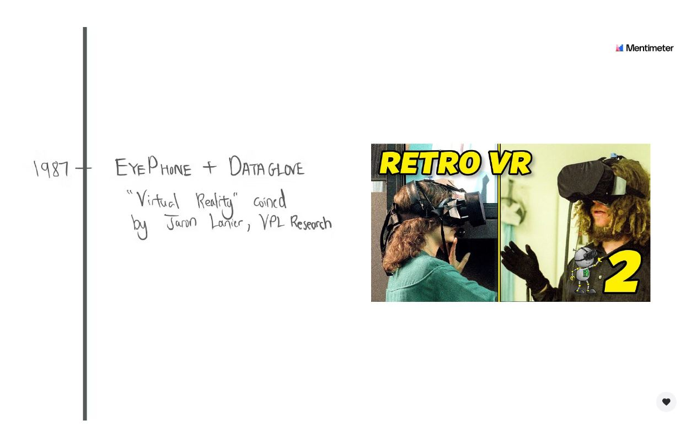

#### Virutality 1000
Virtuality 1000 was a virtual reality (VR) system developed by Virtuality Group plc in the early 1990s. It was one of the first commercial VR systems designed for arcades and entertainment venues, offering immersive gaming experiences to the public.

Here are some key features and aspects of the Virtuality 1000 system:

Hardware: The Virtuality 1000 system consisted of VR headsets, handheld controllers, and a central processing unit (CPU). The headsets provided stereoscopic 3D visuals and head tracking, allowing users to look around and interact with virtual environments. The handheld controllers enabled users to manipulate objects and navigate within the virtual world.

Games and Experiences: Virtuality 1000 offered a variety of games and experiences designed to showcase the capabilities of VR technology. These experiences ranged from immersive games, such as first-person shooters and racing simulations, to virtual tours and educational applications.

Arcade Installations: The Virtuality 1000 system was primarily installed in arcades, entertainment centers, and amusement parks. Players could pay to experience VR games and attractions, making it a popular destination for gaming enthusiasts and curious visitors alike.

Popularity and Impact: Virtuality 1000 helped popularize VR technology in the early 1990s and introduced many people to the concept of immersive virtual experiences. While the system was innovative for its time, it faced challenges such as high costs, limited content, and technical limitations compared to modern VR systems.

Legacy: Despite its limitations, Virtuality 1000 played a significant role in laying the groundwork for the modern VR industry. It demonstrated the potential of VR technology for entertainment and gaming, inspiring future advancements and innovations in the field.

Overall, Virtuality 1000 was an early example of commercial VR technology that provided users with immersive gaming experiences and helped pave the way for the development of modern virtual reality systems.

#### Sega VR
Sega VR, also known as Sega Virtual Reality, was an ambitious virtual reality gaming headset developed by Sega during the early 1990s. Sega, a prominent player in the video game industry, aimed to capitalize on the emerging interest in virtual reality technology with this project. However, the Sega VR headset never made it to the commercial market, and its development was ultimately canceled before it could reach consumers. Here are some key points about the Sega VR:

Development: The development of Sega VR began in the early 1990s as Sega sought to innovate and expand its gaming offerings. The headset was intended to provide players with immersive virtual reality experiences, allowing them to step into the game world like never before.

Features: The Sega VR headset featured stereoscopic 3D visuals and head tracking technology, similar to other VR systems of the time. Players could wear the headset to enter virtual environments and interact with games using their head movements.

Games: Several games were reportedly in development for the Sega VR headset, including titles like "Nuclear Rush" and "Iron Hammer." These games were designed to showcase the capabilities of the VR technology and provide players with unique and immersive gaming experiences.

Cancellation: Despite its promising technology and potential, the Sega VR project faced numerous challenges during development. Issues such as technical limitations, high costs, and concerns about motion sickness and health risks contributed to the cancellation of the project. Sega ultimately decided to abandon the Sega VR headset before it could be released to the public.

Legacy: Although the Sega VR headset never reached consumers, its development reflects the early excitement and experimentation surrounding virtual reality technology in the gaming industry. The project's cancellation also underscores the significant technical and logistical challenges involved in bringing VR hardware to market during the early 1990s.

Overall, Sega VR remains an intriguing footnote in the history of virtual reality gaming, showcasing both the potential and the pitfalls of early attempts to bring immersive VR experiences to the mass market.

#### Sega VR-1
Sega VR-1 was a virtual reality attraction located within Segaworld, an entertainment complex operated by Sega. Segaworld locations were situated in various cities around the world, offering arcade-style gaming experiences and attractions.

The Sega VR-1 attraction provided visitors with the opportunity to experience virtual reality gaming using advanced VR technology for its time. Players would don a VR headset and step into immersive virtual environments, where they could engage in various games and experiences.

While the specifics of the games and experiences offered at Sega VR-1 may vary depending on the location and timeframe, it's likely that they included immersive simulations, interactive experiences, and possibly even multiplayer VR gaming.

Sega VR-1 was part of Sega's efforts to showcase the potential of virtual reality gaming and provide visitors with cutting-edge entertainment experiences. However, as with many early VR ventures, the technology and experiences offered may have been relatively basic compared to modern VR systems.

It's worth noting that Segaworld locations and attractions, including Sega VR-1, have largely disappeared over the years, with the last Segaworld location closing in the early 2000s. Nonetheless, Sega VR-1 represents an early attempt by Sega to incorporate virtual reality into its arcade offerings, reflecting the company's interest in exploring new gaming technologies and experiences.
(Chatgpt could not give much information about this)

#### Nintendo Virtual Boy
The Nintendo Virtual Boy was a unique and pioneering gaming console released by Nintendo in 1995. It was notable for being one of the first gaming systems to offer 3D stereoscopic graphics, though it was ultimately a commercial failure. Here are some key points about the Virtual Boy:

Hardware: The Virtual Boy consisted of a tabletop console with a built-in red LED display and a controller. Unlike traditional handheld consoles, users had to place their heads into a visor-like headset to view the games in 3D. The display technology used red LEDs to create a stereoscopic effect, but it only displayed graphics in monochrome red.

Games: The Virtual Boy had a library of around 22 games, including titles like "Mario's Tennis," "Wario Land," and "Virtual Boy Wario Land." However, due to the system's limitations and commercial failure, the library remained relatively small compared to other Nintendo consoles.

Commercial Failure: Despite its innovative technology, the Virtual Boy was a commercial failure. Several factors contributed to its lack of success, including its high price, limited game library, uncomfortable design, and health concerns related to prolonged use. Additionally, the red monochrome display caused eye strain and headaches for many users.

Discontinuation: Nintendo discontinued the Virtual Boy less than a year after its release, with production ending in 1996. The console was a commercial disappointment for Nintendo, resulting in poor sales and financial losses.

Legacy: While the Virtual Boy was not successful during its initial release, it has gained a cult following among retro gaming enthusiasts and collectors. Its unique design and pioneering use of 3D technology have contributed to its status as a collector's item. Some of the games released for the Virtual Boy have also been praised for their gameplay and innovation.

In summary, the Nintendo Virtual Boy was an ambitious but ultimately unsuccessful attempt by Nintendo to introduce 3D gaming to the mass market. Despite its commercial failure, it remains an interesting footnote in the history of gaming technology and an example of Nintendo's willingness to take risks and innovate in the gaming industry.
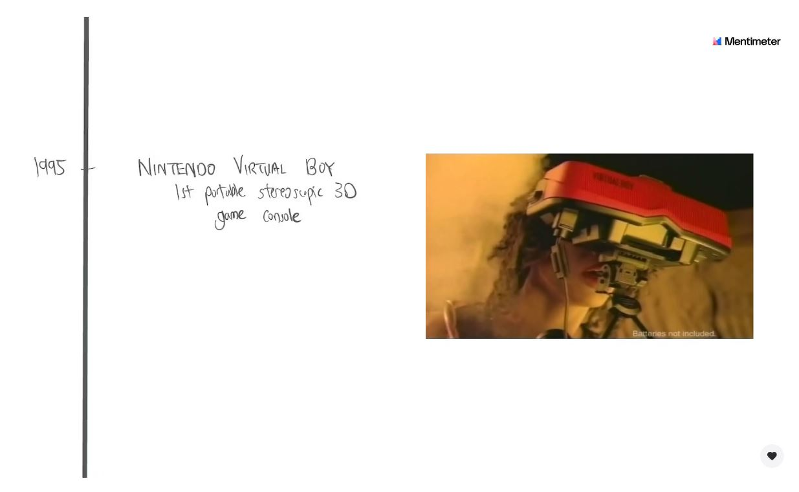

#### E Magin Z800 3D Visor
The eMagin Z800 3D Visor was a head-mounted display (HMD) developed by eMagin Corporation, a company specializing in OLED microdisplays. The Z800 3D Visor was introduced in the mid-2000s and aimed to provide users with immersive 3D experiences for gaming, entertainment, and professional applications. Here are some key features and aspects of the eMagin Z800 3D Visor:

Display Technology: The Z800 3D Visor utilized OLED (Organic Light-Emitting Diode) microdisplays to provide high-resolution visuals to the wearer. OLED displays offer several advantages, including high contrast ratios, fast response times, and vibrant colors, which contribute to a more immersive viewing experience.

Head-Mounted Design: The Z800 3D Visor featured a head-mounted design, allowing users to wear the device comfortably and securely. The visor-style form factor provided a hands-free experience, freeing users to interact with their environment while wearing the HMD.

Stereo 3D Capability: One of the primary features of the Z800 3D Visor was its stereo 3D capability, which enabled users to perceive depth and immersion in virtual environments. The HMD used separate displays for each eye to create a stereoscopic effect, enhancing the realism of 3D content.

Wide Field of View: The Z800 3D Visor offered a relatively wide field of view (FOV), allowing users to perceive a large portion of the virtual environment. A wider FOV enhances immersion by providing a more expansive view of the virtual world, reducing the sense of restriction or limitation.

Applications: The eMagin Z800 3D Visor was marketed for a variety of applications, including gaming, simulation, training, and professional visualization. It was used by gamers seeking immersive gaming experiences, professionals in fields such as engineering and design for visualization and prototyping, and enthusiasts interested in exploring virtual environments.

Success and Impact: While the eMagin Z800 3D Visor garnered attention for its advanced display technology and immersive capabilities, it did not achieve mainstream success on the scale of consumer products like gaming consoles or smartphones. However, it played a role in advancing the development of HMD technology and contributed to the growing interest in virtual and augmented reality applications.
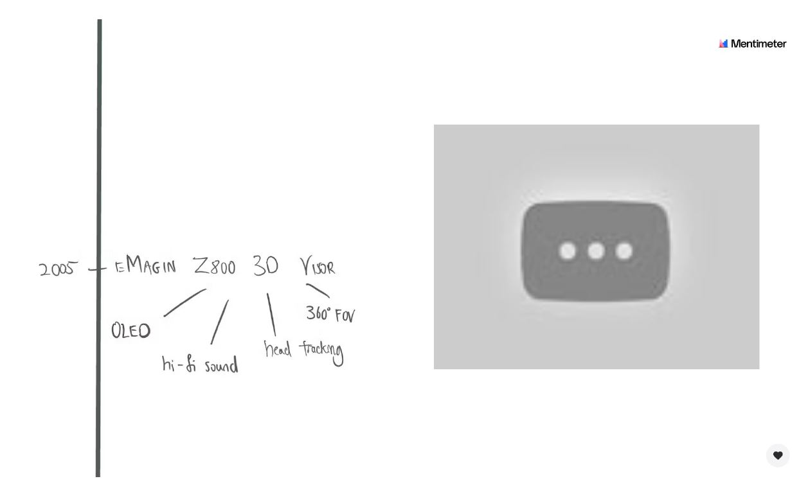

#### Occulus Rift DK1
The Oculus Rift DK1 (Development Kit 1) was one of the earliest versions of the Oculus Rift, a virtual reality (VR) headset developed by Oculus VR, which was later acquired by Facebook. The DK1 was designed primarily for developers to create and test VR content during the early stages of the consumer VR industry. Here are some key features and aspects of the Oculus Rift DK1:

Release Date: The Oculus Rift DK1 was announced in 2012, and the first development kits were shipped to Kickstarter backers and developers in March 2013. It was the first publicly available version of the Oculus Rift headset.

Display: The DK1 featured a 7-inch display with a resolution of 1280x800 pixels, providing stereoscopic 3D visuals to the wearer. While the resolution was relatively low compared to modern VR headsets, it was a significant improvement over previous VR prototypes.

Field of View (FOV): The DK1 offered a field of view (FOV) of approximately 110 degrees diagonal, allowing users to perceive a wide view of the virtual environment. A wider FOV enhances immersion by providing a more expansive and natural view of the virtual world.

Head Tracking: The DK1 was equipped with head-tracking technology that allowed users to move their heads and have those movements reflected in the virtual environment in real-time. This feature enabled more natural and intuitive interaction with VR content.

Development Kit: As the name suggests, the Oculus Rift DK1 was primarily intended for developers to create and test VR experiences. It provided developers with early access to VR hardware and software development tools, allowing them to experiment with new ideas and concepts for VR content.

Community and Feedback: The release of the DK1 sparked widespread interest and excitement in the emerging VR industry. Developers and enthusiasts around the world began creating and sharing VR experiences, contributing to the growth of the VR ecosystem. Feedback from DK1 users also helped Oculus VR refine and improve subsequent iterations of the Oculus Rift.

Successor: The Oculus Rift DK1 was succeeded by the Oculus Rift Development Kit 2 (DK2), which featured improvements in display resolution, refresh rate, and tracking accuracy. The DK2 was followed by the release of consumer versions of the Oculus Rift, marking the beginning of widespread adoption of VR technology.

Overall, the Oculus Rift DK1 played a crucial role in kickstarting the modern VR industry by providing developers with early access to VR hardware and tools. It laid the foundation for subsequent advancements in VR technology and content creation, ultimately leading to the widespread availability of consumer VR headsets.

The price of the DK1 costs USD300
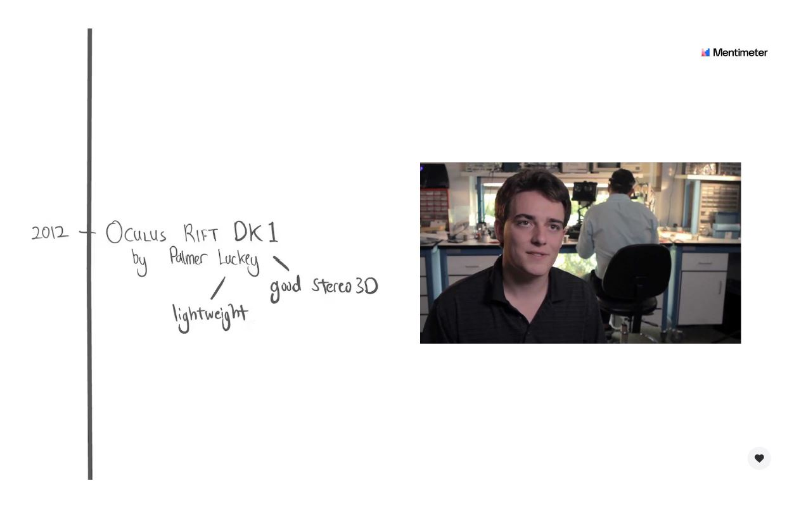

#### Google Cardboard
Google Cardboard is a simple and affordable virtual reality (VR) platform developed by Google. It consists of a fold-out cardboard viewer into which a smartphone can be inserted. When used with compatible apps, the smartphone's screen acts as the display, and the Cardboard viewer provides the lenses and structure to create a basic VR experience. Here are some key points about Google Cardboard:

Origins: Google Cardboard was first introduced by Google at the Google I/O developer conference in June 2014. It was initially conceived as an accessible and low-cost way to bring VR experiences to a wider audience.

Design: The Google Cardboard viewer is made of cardboard (hence the name) and features lenses, a flap that folds down to hold a smartphone, and a button or magnet on the side that interacts with the smartphone's screen. The viewer is designed to be lightweight, portable, and easy to assemble.

Smartphone Compatibility: Google Cardboard works with a wide range of Android and iOS smartphones that meet the minimum screen size requirements. Users simply need to download the Cardboard app from the Google Play Store or the Apple App Store to get started.

VR Experiences: Google Cardboard offers access to a variety of VR experiences and apps available through the Cardboard app or other third-party platforms. These experiences range from immersive games and simulations to educational content, virtual tours, and more.

Open Source: Google Cardboard is an open-source platform, which means that the design specifications and software development kits (SDKs) are freely available for developers to use and modify. This openness has contributed to the widespread adoption and development of Cardboard-compatible apps and experiences.

Popularity and Adoption: Google Cardboard quickly gained popularity due to its affordability and accessibility. It has been used in various educational settings, marketing campaigns, and entertainment experiences. Google has also released updated versions of Cardboard and worked with partners to create customized Cardboard viewers.

Impact: While Google Cardboard may not offer the same level of immersion or functionality as higher-end VR systems like the Oculus Rift or HTC Vive, it has played a significant role in democratizing VR technology and making it more accessible to the general public. It has also served as a valuable entry point for developers interested in creating VR content.

Overall, Google Cardboard represents an innovative and inclusive approach to virtual reality, demonstrating how a simple and inexpensive viewer can unlock immersive experiences for millions of users worldwide.
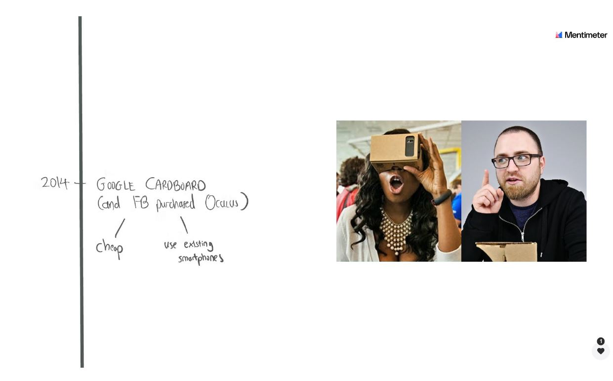

# All the other VR

The image appears to be a continuation of the previous one, showing a timeline of virtual reality (VR) headsets and their progression over the years.

On the left side, there's text denoting significant years and the corresponding VR headsets released:

2015: Samsung Gear VR
2016: HTC Vive, Oculus Rift, PlayStation VR
These were all major VR headsets released in those years, marking significant developments in consumer VR technology.

The Samsung Gear VR was a mobile VR headset developed in collaboration with Oculus. It used a Samsung Galaxy smartphone as the display and processor.

In 2016, several high-profile VR systems were released:

HTC Vive: Developed by HTC and Valve Corporation, known for its room-scale VR capabilities that allow the user to move around in a virtual space.
Oculus Rift: One of the first successful consumer-facing PC-based VR headsets, developed by Oculus VR, a division of Facebook Inc.
PlayStation VR: Sony's VR headset for the PlayStation 4 gaming console, making VR more accessible to console gamers.

### Definitions
#### What is XR
Chatgpt says:
"XR" stands for Extended Reality, and it's an umbrella term that covers various forms of computer-altered reality, including:

Virtual Reality (VR): This technology immerses users in a fully artificial digital environment. VR requires the use of headsets that take over your vision to give you the impression that you're somewhere else.

Augmented Reality (AR): AR overlays digital content on the real world through either a display device like a smartphone or smart glasses. It doesn't replace the real world with a virtual one; it adds to it with images, sounds, and other virtual enhancements.

Mixed Reality (MR): MR combines elements of both AR and VR, real-world and digital objects interact. Mixed Reality can be experienced through a headset or on next-generation computing devices, providing the ability to see and immerse yourself in the world around you even as you interact with a virtual environment using your own hands—all without ever removing your headset. It is sometimes considered an advanced form of AR.

XR technologies are used in various applications like gaming, education, healthcare, military, and many other fields. They offer immersive experiences and are being explored for their potential to provide training, enhance the user experience, and improve productivity in various industries.

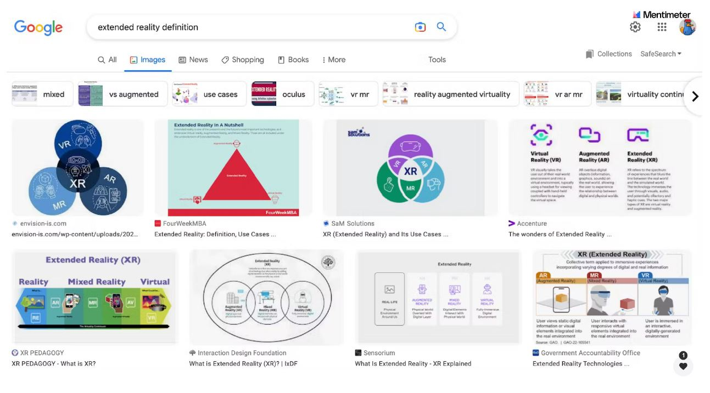

### Immersification Continuum
No idea what this is 
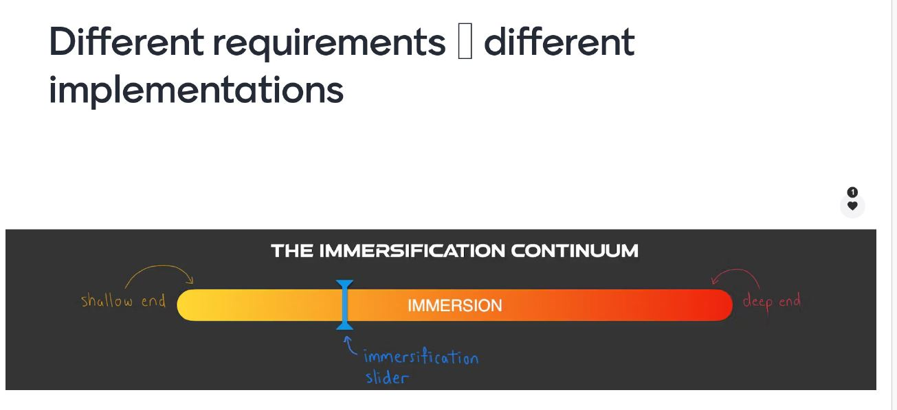

### Milgram Kishino RV Continuum
The Milgram-Kishino Virtuality Continuum, often referred to simply as the "Virtuality Continuum," is a conceptual framework proposed by Paul Milgram and Fumio Kishino in 1994. This continuum categorizes reality and virtuality into a spectrum ranging from the physical world to fully immersive virtual environments. It aims to provide a framework for understanding and categorizing different types of environments based on their level of virtuality and the degree of presence experienced by users. Here's an overview of the Virtuality Continuum:

Physical Reality (Physical World): At one end of the continuum is physical reality, which represents the real-world environment that we perceive through our senses. This includes the tangible physical objects, spaces, and interactions that we experience in the physical world.

Augmented Reality (AR): Moving along the continuum, augmented reality (AR) overlays virtual content onto the physical environment, enhancing or augmenting the user's perception of reality. AR technology integrates digital information, such as images, text, or 3D models, with the user's view of the real world in real-time.

Augmented Virtuality (AV): Augmented virtuality represents environments where physical elements are integrated into a predominantly virtual environment. In AV, virtual content is the primary focus, but elements of the physical world are incorporated to enhance the virtual experience. An example of AV might be a virtual training simulation where physical objects or props are used alongside virtual environments.

Virtual Reality (VR): Further along the continuum is virtual reality (VR), where users are fully immersed in a simulated environment that is entirely computer-generated. VR technology typically involves head-mounted displays (HMDs) and other sensory input devices to create a sense of presence and immersion within the virtual environment.

Mixed Reality (MR) and Extended Reality (XR): Mixed reality (MR) and extended reality (XR) are terms that encompass a spectrum of environments that combine elements of both the physical and virtual worlds. These terms are often used interchangeably to refer to environments where virtual and physical elements coexist and interact in real-time, providing users with varying levels of immersion and presence.

The Virtuality Continuum provides a useful framework for understanding the relationship between different types of environments based on their level of virtuality and the degree of immersion experienced by users. It acknowledges that the boundaries between physical reality, augmented reality, and virtual reality are fluid and that technologies such as AR, VR, MR, and XR can blend these elements in diverse and innovative ways.

### RV Continuum and IM Continuum
Extent of World Knowledge (EWK) Continuum: This measures how much of the real world is modeled in the system. It goes from no real-world modeling to a fully detailed virtual model of the real world.

Reproduction Fidelity (RF) Continuum: This scale assesses the quality of the virtual content's reproduction, ranging from no virtual content to a level where real and virtual content are indistinguishable.

Extent of Presence Metaphor (EPM) Continuum: This measures the degree to which the system allows user interaction, from no display to fully immersive environments where virtual interactions are indistinguishable from direct viewing and interaction in the real world.

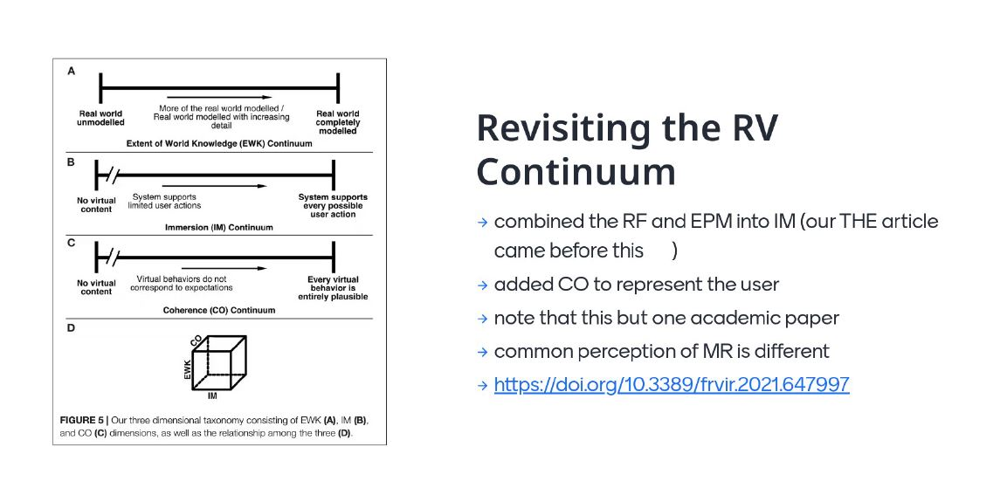

### Mentimeter Questions

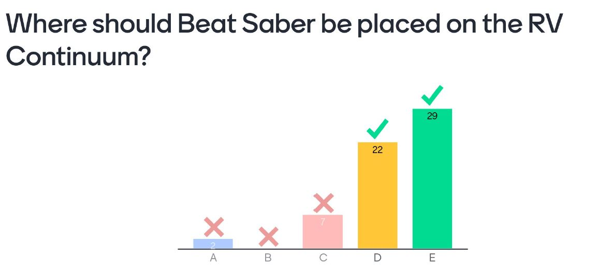
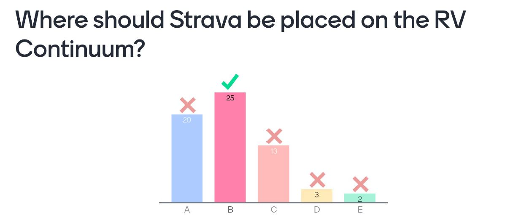

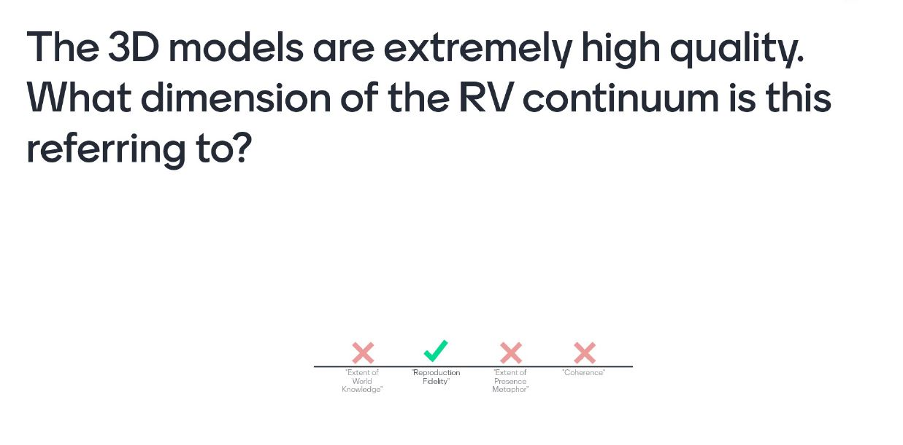

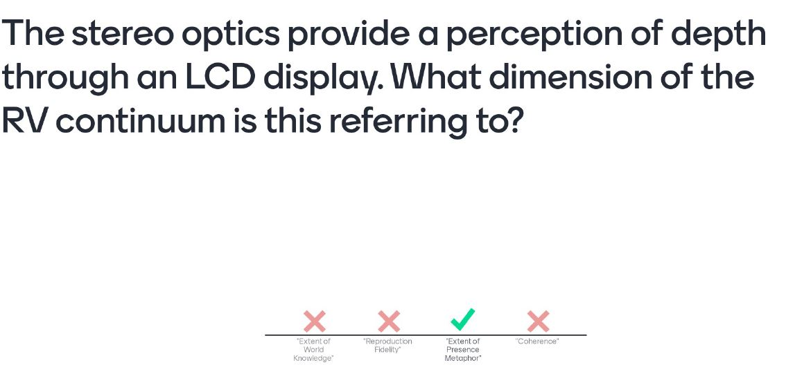

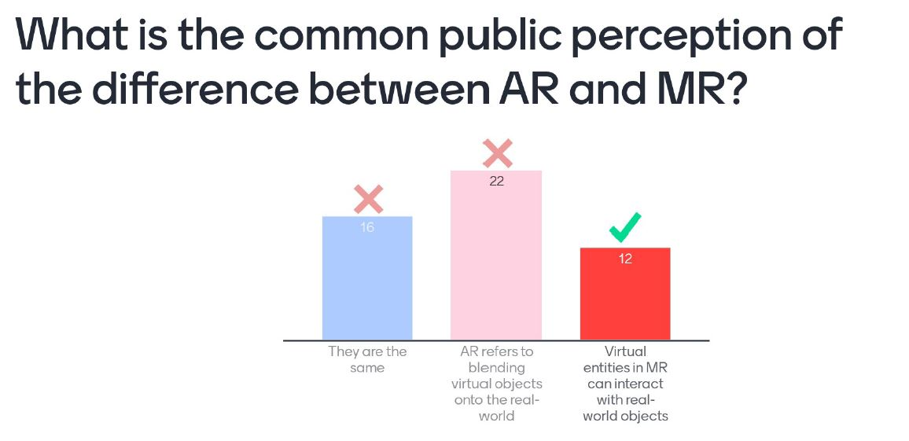
