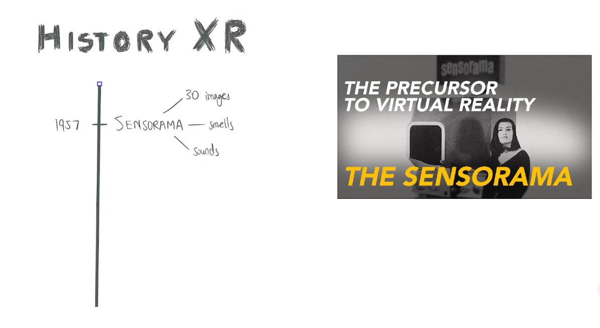

# VR_KringleCompany
Great Asset, Great Great Asset

## Week 1

### Sensorama 
It was an early example of immersive, multi-sensory technology developed in the 1960s by filmmaker Morton Heilig. It was one of the first attempts at creating a virtual reality (VR) experience. The Sensorama was essentially a mechanical device resembling an arcade game cabinet that included a stereoscopic 3D display, stereo sound, vibration, and even scent generators. Users would sit in front of the machine with their head placed in a head-mounted display (HMD) and experience short films that engaged multiple senses simultaneously.

The Sensorama aimed to provide an immersive experience by stimulating various senses to create a more realistic environment. While it didn't gain widespread popularity or commercial success at the time, it laid the groundwork for future developments in VR technology. Today, Sensorama is recognized as an important milestone in the history of virtual reality and immersive media.

