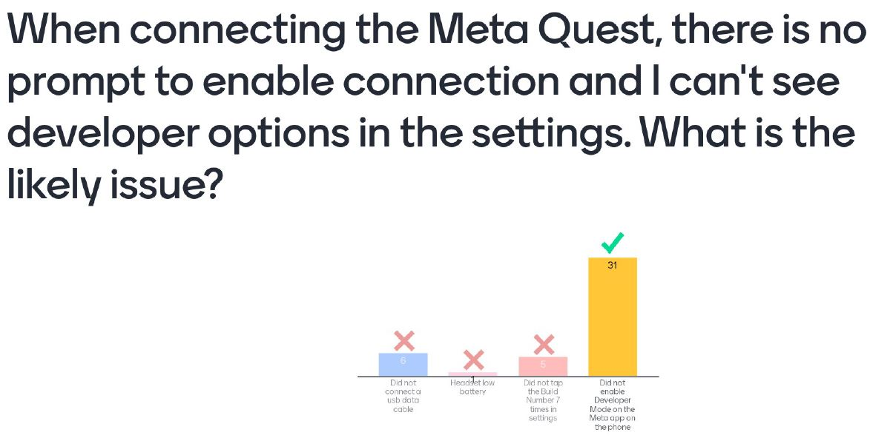

# VR_KringleCompany
Great Asset, Great Great Asset

## Possible Choices for why you choose a paraticular framework
1. Documentation
2. Code Management / Collab
3. Asset creation
4. Dev Tools

Unity

Unreal
Chosen For intensive and high quality graphics

AFrame
According to Chatgpt
A-Frame is an open-source web framework for building virtual reality (VR) experiences. It is primarily used for creating VR scenes, applications, and experiences that run in a web browser. A-Frame is built on top of HTML, making it accessible to web developers who are already familiar with HTML, CSS, and JavaScript. With A-Frame, developers can create 3D, VR-enabled content using a simple HTML-like syntax, making it easier to design, iterate, and deploy VR applications without the need for complex WebGL APIs directly.

A-Frame is based on the Entity-Component-System (ECS) architecture, which is a common pattern in game development. In A-Frame, everything in the scene is an entity represented by HTML elements, and functionality is added to these entities through components that can modify their appearance, behavior, and functionality. This approach allows for high modularity, reusability, and simplicity in developing VR scenes.

Developers can extend A-Frame's core functionality by creating custom components using JavaScript, enabling the integration of external libraries and APIs for more complex interactions, animations, and data visualization in 3D and VR. A-Frame supports WebVR and WebXR APIs, allowing it to work across various devices such as VR headsets (e.g., Oculus Rift, HTC Vive), mobile devices with cardboard viewers, and desktop/laptop browsers, providing a wide platform reach.

A-Frame is designed to be accessible for beginners while also powerful enough for advanced developers to build sophisticated VR experiences. It has fostered a growing community that contributes to its development, shares components, and provides resources, making it a popular choice for web-based VR projects.

According to Chek
Pros: designed to be a highly accessible tool for new VR developers with some programming Foundations at the same time it is highly extensible to allow experienced devs to create highly complex VR experiences as well note that applications developed by A-frame can only exist on the web which has the usual obvious pros and cons

Cons: 
the biggest con is perhaps the level of immersion from A System's point of view that is limited by what web Technologies can provide and in many ways limited by the browser developers as well however that is slowly improving as we move from webgl to web GPU which without delving into the rapid hole of advanced rendering topics simply means that we get more and more direct access to Hardware right from your browser relatedly the number of differences between each of the popular browsers is. WebXR resolves that somewhat

## Mentimeter Questions

