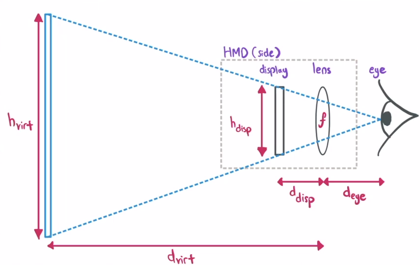
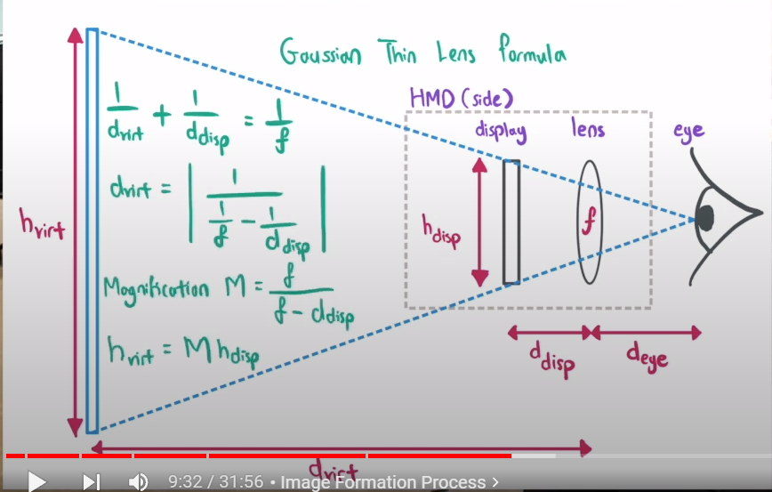
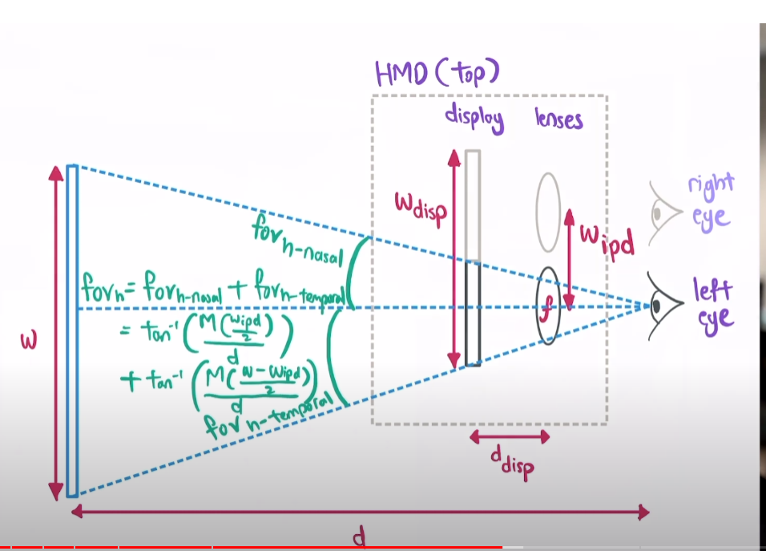
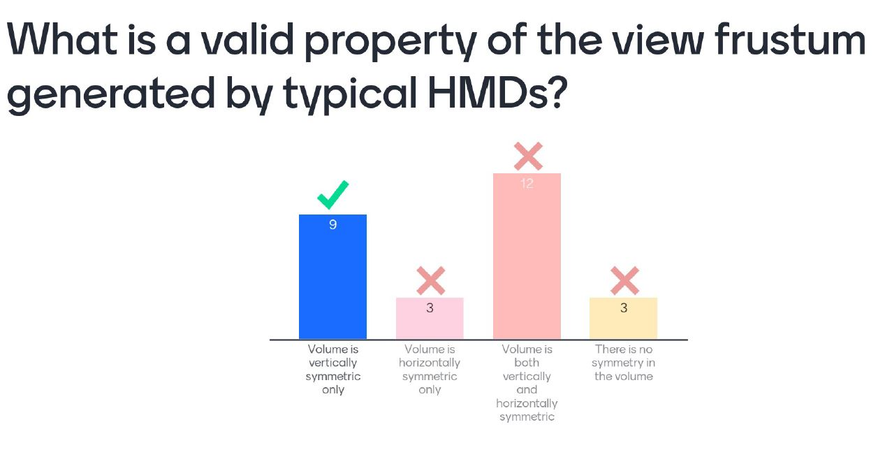
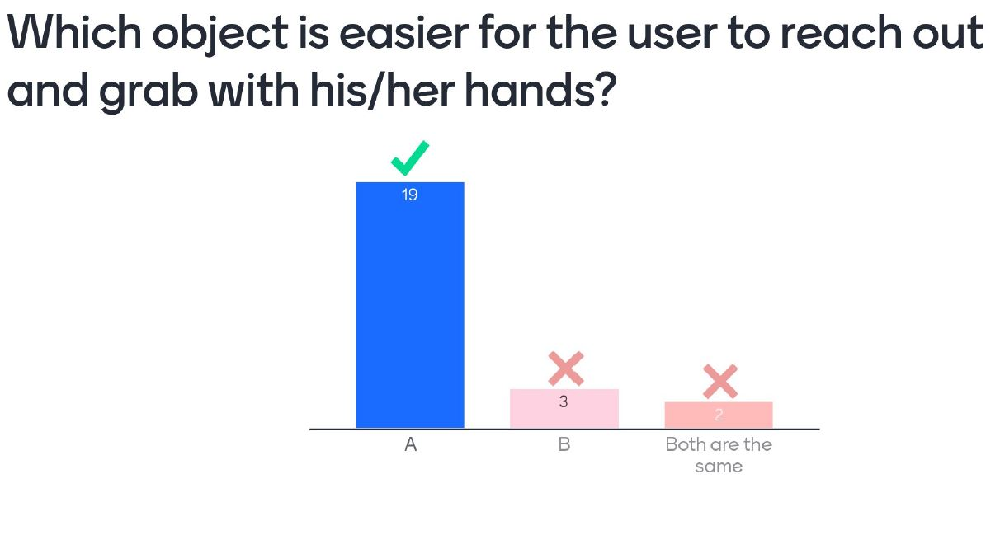
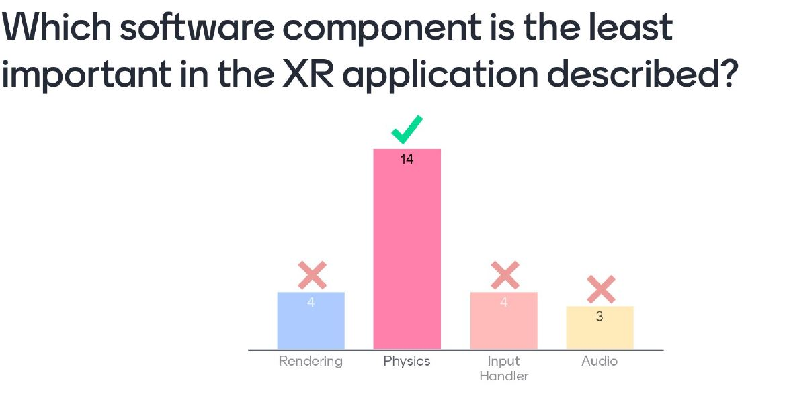

# VR_KringleCompany
Great Asset, Great Great Asset

## Types of XR Devices
VR - Meta Quest, HTC Vive
AR - Magic Leap and your phones
MR - Hololens
Blurring the lines - Meta Quest Pro

## Common H/W Components
VR HMD - PCVR - Comes with sensors and wirse
    - Standalone VR - No cables and inside out tracking
    
AR HMDs - Mobile Phones

XR HMDs - Become increasing common

Components - Display Screen, 2 Magnifier Glasses and Specicialized Contols that emit infrared lights and motion tracking sensors to detect these lights and other motion traciking sensors to detect these lights, other motion tracking sensors, cameras all overs, a battery, spekers, CPU, GPU, motherboard and sensors that can be found on a modern day smartphone

Smartphone has alot of the same parts as VR headsets but phones do not have HMDs.

Modern Hardwares - Wearable Motion Trackers, eye trackers (helps to improve immersion)

## Image Formation in HMDS
1. Focal Length = f
2. Eye relief = Deye
3. Screen Lens Distance = Ddisp
4. IPD = Interpupuilery Distance
5. For the left eye - the Wvirt1 > Wvirt2 and for the right eye Wvirt2 < Wvirt1
6. The result from above produces a horizontally asymmetric view frustrum and creates different images but look from above, it looks the same
7. 1 - 4 contains the values needed to generate the perspective projection matrix that defines the virtual view frustrum in particular the near and far plane depths, the height and the left and right widths of the the virtual view frustrum. You can also obtain values for the view matrix (how the eyes look at the frustrum), Values obtained: positions of the eye and where the eye look at

8. You can use all of these libraries in low level graphics libraries to actually create the image.
9. The angles for the FOV for top and side are calculated differently because the top produces different images and therefore different angles. For the top FOV, you need to get the nasal angle and the temporal angle and this helps you to get the monocular fov (combined visual span but seen indivdually) and the binocular fov (combined visual span as seen by both eyes)

10. Lens Distortion - 

Lens distortion is a common optical issue that affects the way images are captured by lenses. It can make straight lines appear curved or bent, altering the geometric shape and proportions of objects in the image. There are two primary types of lens distortion:

Barrel Distortion: This occurs when the edges of an image appear to bulge outwards from the center, creating a barrel-like shape. It's most common in wide-angle lenses.

Pincushion Distortion: In this case, the edges of the image appear to pinch in towards the center, making the image look like it's being viewed through a pincushion hole. It's often seen in telephoto lenses.

To correct lens distortion, algorithms typically involve mapping each pixel in the distorted image back to its correct position. One simple algorithm for correcting lens distortion involves the following steps:
Remap the Pixels: After calculating the corrected positions for each pixel, the image is reconstructed by mapping pixels from their original locations to the corrected locations. This process can interpolate between pixel values to ensure the image remains smooth and details are preserved.

This algorithm is a simplification and starting point. In practice, correcting lens distortion, especially for complex or severe distortions, might require more sophisticated models and algorithms, including those that account for radial and tangential distortion or use more complex distortion models with higher-order terms and different coefficients. Many image editing and processing software packages include tools to correct lens distortion automatically or allow manual adjustments based on lens profiles or user input.
Identify the Distortion Parameters: This involves understanding the type and amount of distortion introduced by the lens. These parameters are often determined through calibration processes, where known shapes (like checkerboard patterns) are photographed and analyzed.

Apply a Correction Formula: The correction involves adjusting the position of each pixel in the image based on the distortion parameters. 

11. Chromatic Abberations - I used chatgpt
Chromatic aberration is a type of distortion in optical systems where light of different colors does not converge at the same point after passing through a lens. It occurs because lenses have a different refractive index for light of different wavelengths, which means that colors of the spectrum are focused at slightly different distances from the lens. This effect can cause images to have colored edges around objects, especially towards the edges of the visual field.

## Common S/W Components
RTIS actually :)
Video games are a subset of software components.
Components are essentially engine components - Renering, physics, inputs, audio ai,
Do i need to explain these systems?
He mentions ECS as well

## Mentimeter Questions

