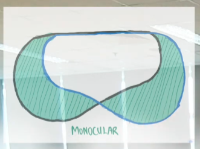
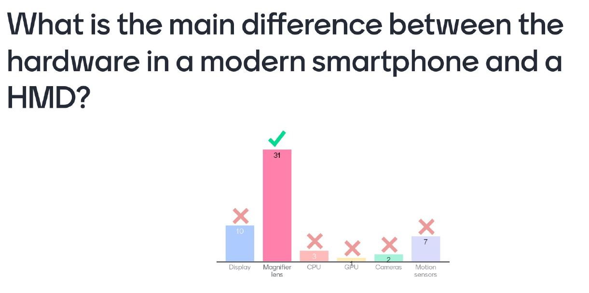
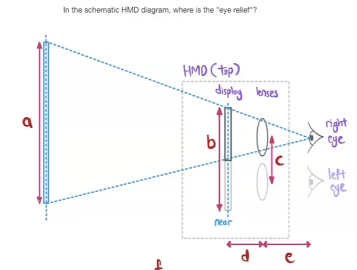
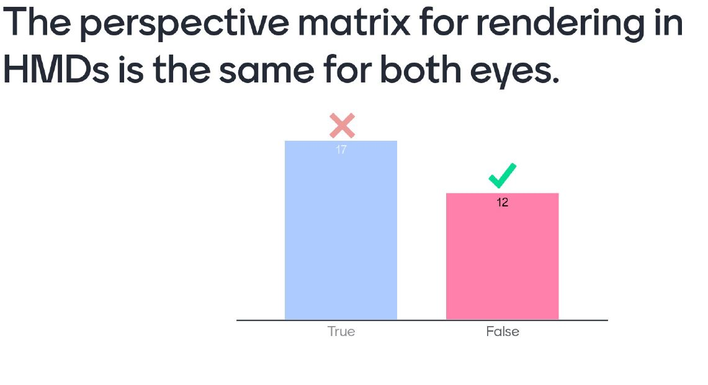
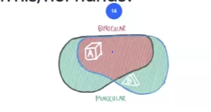
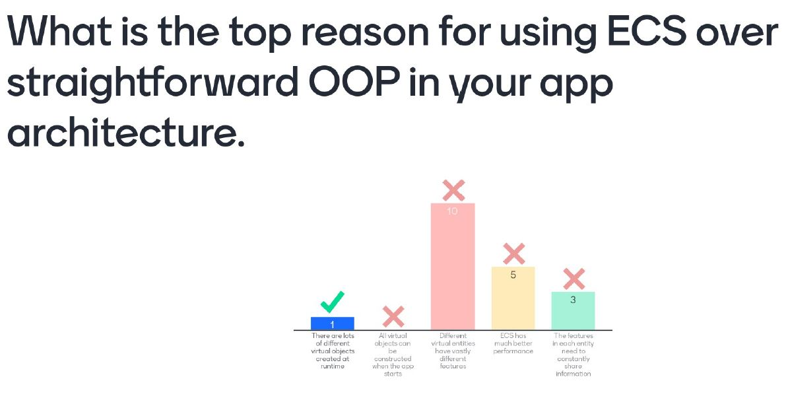

# VR_KringleCompany
Great Asset, Great Great Asset

## Types of XR Devices
VR - Meta Quest, HTC Vive
AR - Magic Leap and your phones
MR - Hololens
Blurring the lines - Meta Quest Pro

## Common H/W Components
VR HMD - PCVR - Comes with sensors and wirse
    - Standalone VR - No cables and inside out tracking
    
AR HMDs - Mobile Phones

XR HMDs - Become increasing common

Components - Display Screen, 2 Magnifier Glasses and Specicialized Contols that emit infrared lights and motion tracking sensors to detect these lights and other motion traciking sensors to detect these lights, other motion tracking sensors, cameras all overs, a battery, spekers, CPU, GPU, motherboard and sensors that can be found on a modern day smartphone

Smartphone has alot of the same parts as VR headsets but phones do not have HMDs.

Modern Hardwares - Wearable Motion Trackers, eye trackers (helps to improve immersion)

## Image Formation in HMDS
1. Focal Length = f
2. Eye relief = Deye
3. Screen Lens Distance = Ddisp
4. IPD = Interpupuilery Distance
5. For the left eye - the Wvirt1 > Wvirt2 and for the right eye Wvirt2 < Wvirt1
6. The result from above produces a horizontally asymmetric view frustrum and creates different images but look from above, it looks the same
7. 1 - 4 contains the values needed to generate the perspective projection matrix that defines the virtual view frustrum in particular the near and far plane depths, the height and the left and right widths of the the virtual view frustrum. You can also obtain values for the view matrix (how the eyes look at the frustrum), Values obtained: positions of the eye and where the eye look at

The trapezium that is created from the display the the virtual image, If you were to divide it into 2, the volume is the same

The trapezium that is created from the display the the virtual image, If you were to divide it into 2, the volume is not the same

### The Perspective Matrix
Purpose: The perspective matrix is responsible for creating the illusion of depth in a 3D scene. It does this by simulating how objects appear to get smaller as they get further away, just like in real-world perspective.
How it works: The perspective matrix transforms 3D coordinates into a form where closer objects appear larger, and farther objects appear smaller. This transformation is essential for making a VR scene feel realistic.
Key parameters: The perspective matrix is typically defined by:
Field of View (FOV): Controls how wide the viewing angle is.
Aspect Ratio: The ratio of the width and height of the viewport.
Near and Far Clipping Planes: The minimum and maximum distances at which objects are rendered.

### The View Matrix
Purpose: The view matrix positions the viewer (or camera) within the virtual world. It determines where you're looking and what you see within the VR environment.
How it works: The view matrix is created by combining the camera's position, rotation, and up direction. Think of it as how you'd move your head in VR to look around.
Transformation: It essentially does the following:
Translates the world coordinates by the inverse of the camera's position (moving the world as if the camera were always at the origin).
Rotates the world coordinates by the inverse of the camera's rotation (simulating your head turning).

### Projection Matrix
Purpose:

The projection matrix in VR is fundamentally the same as it is for traditional 3D graphics. Its primary role is to simulate perspective by transforming 3D coordinates into 2D screen coordinates for each eye of your VR headset.
This transformation creates the illusion of depth and ensures that objects in your VR environment appear the correct size and shape relative to your perceived position.
How VR Projection Matrices Differ:

Two Matrices: VR headsets require separate projection matrices for each eye to account for the different viewpoints generated by the separate lenses.
Asymmetrical Frustums: Rather than symmetrical viewing frustums like those in traditional monitors, VR projection matrices often represent slightly asymmetrical frustums. This accommodates the unique way VR lenses bend light to create a focused image inside the headset.
Lens Distortion Adjustment: VR lenses introduce optical distortion. The projection matrix is sometimes used to pre-distort the image, counteracting this effect for a more natural and comfortable viewing experience.
Key Parameters:

The projection matrix in VR incorporates similar parameters to a standard projection matrix, but it may adjust them slightly for each eye and the headset's specific optics:

Field of View: Describes the angular width of the visible area for each eye.
Aspect Ratio: The ratio of the width to height of the viewport on each display.
Near and Far Clipping Planes: Define the minimum and maximum distances at which objects are rendered.
Lens Distortion (Specific to VR): May include coefficients to describe the distortion introduced by the lenses to create the pre-distortion effect.

### Effect of Identical Projection Matrices
Loss of Stereoscopic 3D: The primary and most immediate impact would be the complete loss of depth perception. Each eye would essentially see the same flat image, eliminating the cues our brains use to perceive objects in three dimensions. The VR experience would feel less immersive and more like looking at a traditional 2D screen.
Distortion and Discomfort: Without accounting for subtle differences in perspective and lens properties for each eye, the image may appear distorted or uncomfortable. This could lead to eye strain and headaches.

### Effect of Identical View Matrices
No Head Tracking Response: Your head movements wouldn't be reflected in the VR environment. If you turned your head left, both eyes would continue to see the same image as if you were looking straight ahead. This would feel incredibly unnatural and break the illusion of being present within the virtual world.

### Effect of Identical Perspective Matrices
Confused Depth Perception: The perspective matrix simulates how objects should appear smaller as they are farther away. If both eyes used the same perspective matrix, depth perception would be severely compromised. Objects might appear warped or unnaturally sized.

### Monocular, Binocular
11. The angles for the FOV for top and side are calculated differently because the top produces different images and therefore different angles. For the top FOV, you need to get the nasal angle and the temporal angle and this helps you to get the monocular fov (combined visual span but seen indivdually) and the binocular fov (combined visual span as seen by both eyes)

It is generally much easier to grab an object in VR using binocular vision compared to monocular vision. This is due to several key factors related to depth perception and hand-eye coordination:

Binocular Vision Provides Depth Perception:

Binocular vision, which relies on using two eyes, allows us to perceive depth by combining the slightly different images from each eye. This depth perception is crucial for accurately judging the distance and position of objects in 3D space, which is essential for tasks like grasping.
Monocular vision, relying on only one eye, lacks this inherent depth perception. While some monocular depth cues exist, like perspective and relative size, they are often less reliable and require more cognitive effort to interpret, making precise grasping more challenging.
Improved Hand-Eye Coordination:

Binocular vision also plays a vital role in hand-eye coordination. By aligning our eyes with our hands during reaching and grasping, we can visually guide our movements with greater precision and control. This coordination is crucial for accurately judging hand-position relative to the object we want to grab.
Monocular vision can disrupt this natural hand-eye coordination to some extent. The lack of depth perception can make it harder to gauge the exact distance and position of the hand relative to the object, leading to misjudgments and inaccurate grasping attempts.
VR and the Amplified Effect:

These limitations of monocular vision are often amplified in VR environments compared to the real world. VR headsets typically have smaller fields of view and lower resolution displays compared to our natural vision, further reducing the available depth cues in monocular vision.
Additionally, the way VR objects are rendered and the limitations of motion tracking systems can introduce slight discrepancies between perceived and actual object positions, making depth perception in VR even more challenging with one eye.
Overall, while it is possible to learn to grasp objects in VR with monocular vision, the lack of depth perception and the limitations of VR environments make it a significantly more difficult and error-prone task compared to using binocular vision.

The image you sent unfortunately does not directly illustrate the concepts of binocular and monocular vision, as it depicts two separate lenses rather than a single perspective. However, it does serve as a reminder of the distance between the two eye and the information they provide to our brain.

### Lens Distortion - 
Lens distortion is a common optical issue that affects the way images are captured by lenses. It can make straight lines appear curved or bent, altering the geometric shape and proportions of objects in the image. There are two primary types of lens distortion:

Barrel Distortion: This occurs when the edges of an image appear to bulge outwards from the center, creating a barrel-like shape. It's most common in wide-angle lenses.

Pincushion Distortion: In this case, the edges of the image appear to pinch in towards the center, making the image look like it's being viewed through a pincushion hole. It's often seen in telephoto lenses.

To correct lens distortion, algorithms typically involve mapping each pixel in the distorted image back to its correct position. One simple algorithm for correcting lens distortion involves the following steps:
Remap the Pixels: After calculating the corrected positions for each pixel, the image is reconstructed by mapping pixels from their original locations to the corrected locations. This process can interpolate between pixel values to ensure the image remains smooth and details are preserved.

This algorithm is a simplification and starting point. In practice, correcting lens distortion, especially for complex or severe distortions, might require more sophisticated models and algorithms, including those that account for radial and tangential distortion or use more complex distortion models with higher-order terms and different coefficients. Many image editing and processing software packages include tools to correct lens distortion automatically or allow manual adjustments based on lens profiles or user input.
Identify the Distortion Parameters: This involves understanding the type and amount of distortion introduced by the lens. These parameters are often determined through calibration processes, where known shapes (like checkerboard patterns) are photographed and analyzed.

Apply a Correction Formula: The correction involves adjusting the position of each pixel in the image based on the distortion parameters. 

### Chromatic Abberations
Chromatic aberration is a type of distortion in optical systems where light of different colors does not converge at the same point after passing through a lens. It occurs because lenses have a different refractive index for light of different wavelengths, which means that colors of the spectrum are focused at slightly different distances from the lens. This effect can cause images to have colored edges around objects, especially towards the edges of the visual field.

## Common S/W Components
RTIS actually :)
Video games are a subset of software components.
Components are essentially engine components - Renering, physics, inputs, audio ai,
Do i need to explain these systems?
He mentions ECS as well

## Mentimeter Questions

The image below is used for Q2 and 3

In this case - The depth here represeents Dvirt. I thought it was distance but oh well

