# VR_KringleCompany

Great Asset, Great Great Asset

Didnt watch the video hehe. I used chatgpt to summarise it, it might not be accurate

## Interaction Mechanics:

The video explained that the nature of user interactions within immersive applications is largely determined by the hardware components available. Different devices and setups offer varying capabilities and constraints, influencing how users can interact with the virtual environment.
It emphasized the dependency of interaction mechanics on the hardware, illustrating that the design and implementation of these mechanics must consider the limitations and affordances of the system in use.
The discussion included how these mechanics are integral to creating immersive and intuitive user experiences, suggesting that the choice of hardware and corresponding interaction design should be aligned with the application's objectives and user expectations.

Examples Provided:
Desktop Simulation: The use of traditional input devices like keyboards, mice, or joysticks in desktop-based virtual environments was discussed. For instance, key presses or mouse clicks to navigate or interact within a simulation represent basic interaction mechanics tailored to desktop setups.

VR Environments: The video highlighted how VR systems like HTC Vive employ motion-tracked controllers to allow users to reach, grab, or manipulate virtual objects in a more natural and intuitive way compared to desktop interfaces. This example illustrated a more advanced interaction mechanic that leverages VR's immersive capabilities.

Comparison Between Desktop and VR: By contrasting the interaction mechanics in desktop simulations with those in VR environments, the video underscored the impact of hardware on the design of these mechanics. While a mouse click in a desktop environment might select an item, in VR, the user might physically reach out and grab it, providing a more immersive experience.

## Viewpoint Control

Definition and Importance: Viewpoint control is defined as the ability of users to dynamically control their perspective within a virtual environment. It's considered an essential feature in all VR and immersive systems, allowing users to look around and explore the virtual space as if they were physically present.

Passive Interaction: Viewpoint control is often categorized as a passive form of interaction. It occurs in the background, enabling users to navigate and observe the virtual environment without making conscious efforts. This seamless control is crucial for maintaining immersion and preventing users from feeling disconnected from the virtual world.

Impact on Immersion and Cyber Sickness: The quality of viewpoint control directly influences the user's immersion level and susceptibility to cyber sickness. Better viewpoint control, which closely matches how we perceive the real world, can reduce the chances of experiencing cyber sickness.

Hardware Dependency: The fidelity of viewpoint control varies significantly across different hardware. For instance, VR head-mounted displays (HMDs) offer high-fidelity viewpoint control, closely mimicking real-world experiences, whereas desktop-based virtual environments provide a less immersive experience due to the limitations of keyboard and mouse controls.

Applications Across Platforms: The concept extends beyond VR to other immersive technologies like augmented reality (AR) and mixed reality (MR), where users must also be able to control their viewpoint to interact effectively with digital elements overlaid on the real world.

Design Considerations: When designing immersive applications, it's important to consider the level of viewpoint control needed based on the desired immersion level and the hardware being used. This ensures that the users' experience is as natural and engaging as possible.

## Hand Gestures

Importance of Hand Gestures: Hand gestures allow users to interact with virtual environments in an intuitive and natural way, enhancing the sense of presence and immersion. They enable actions like touching, grabbing, or manipulating virtual objects, which are fundamental to many VR experiences.

Fidelity of Hand Interactions: The video emphasizes that the fidelity of hand interactions can vary greatly depending on the technology used. High-fidelity interactions, where the users' hand movements are accurately translated into the virtual environment, provide a more immersive and intuitive user experience.

Haptic Gloves: One of the highest fidelity hand interaction technologies mentioned is haptic gloves. These gloves can provide detailed tactile feedback, simulating the sensation of touching or holding objects in the virtual world, thereby greatly enhancing the realism of hand gestures.

VR Controllers: Most consumer VR systems use motion-tracked controllers as a proxy for hands. These controllers can detect hand positions and movements, allowing for effective interaction with the virtual environment. Some advanced controllers also have capacitive sensors or pressure-sensitive buttons to detect finer finger movements or gestures.

Computer Vision for Hand Tracking: Advances in computer vision technology have enabled direct hand tracking in VR, eliminating the need for physical controllers. This technology can track finger movements and gestures, offering a more natural and direct way of interacting with virtual environments. However, the video notes that this technology still faces challenges, particularly in providing reliable and accurate tracking without haptic feedback.

Implications for Design: The choice of hand gesture technology has significant design implications. Developers must consider the trade-offs between the naturalism and precision of direct hand tracking versus the reliability and haptic feedback provided by traditional controllers.

Accessibility and Inclusivity: While the video focuses on hand gestures, it also acknowledges the broader context of accessibility, implying that immersive experiences should also consider alternative interaction mechanisms for users who may not be able to use standard hand gesture controls.

## Body Gestures

Embodiment in VR: Full body gestures contribute to a sense of embodiment, where users feel that their virtual representation accurately mirrors their real body movements. This concept is crucial for creating immersive experiences that make users feel present and engaged within the virtual environment.

Hardware Requirements: Implementing full body gestures requires additional hardware that can track various body parts. This could include IMU-based trackers, which are placed on different body segments to capture movement accurately.

Application Examples: The video mentions the use of technology like 360 treadmills and haptic suits, which can simulate walking or other full-body interactions in a virtual space. These devices help bridge the gap between the physical and virtual worlds, allowing for more natural and intuitive user experiences.

Design Considerations: When designing immersive applications that incorporate full body gestures, it's important to consider the specific use case and desired level of immersion. For example, a VR cycling experience might only require leg tracking, while a more comprehensive simulation might need a full set of body trackers.

Limitations of Desktop Modalities: Unlike hand gestures or viewpoint control, there's no straightforward desktop equivalent for full body gestures. This limitation emphasizes the need for specialized hardware when aiming to create deeply immersive environments that utilize full body movements.

Accessibility and Inclusivity: The discussion also highlights the importance of considering diverse user needs, including those who may not be able to use standard controllers or trackers. Developing inclusive design strategies ensures broader accessibility of immersive technologies.

## Interaction Authenticity

Natural Interactions: These are designed to mirror real-world actions within a virtual setting, helping users feel more present and engaged in the immersive environment. The video emphasized that natural interactions should be intuitive, leveraging users' real-life experiences to guide their behaviors in the virtual world.

Artificial Interactions: These interactions do not have real-world analogs and are crafted specifically for virtual environments. They can offer unique and novel experiences that are only possible within the context of immersive technology. The video highlighted the creative potential of artificial interactions in enhancing the immersive experience and providing users with capabilities beyond the constraints of physical reality.

Designing for Authenticity: When designing immersive experiences, it's crucial to decide the level of interaction authenticity that aligns with the application's goals. For simulations and training applications, high natural authenticity is important to ensure skills transfer to the real world. Conversely, games or fantastical experiences might leverage artificial interactions to create engaging and novel experiences.

Balancing Interactions: The video suggests that while some applications may benefit from purely natural or purely artificial interactions, many will use a mix of both to achieve their desired outcomes. Designers must carefully balance these elements to create compelling and intuitive user experiences.

Impact on User Experience: The authenticity of interactions can significantly affect how users perceive and engage with the virtual environment. Authentic interactions can enhance immersion and presence, making the virtual experiences more impactful and meaningful.

Consideration of Use Cases: The choice between natural and artificial interactions should be informed by the specific use cases and objectives of the immersive application. Understanding the audience and the context in which the application will be used is crucial for designing appropriate interaction mechanics.

## GUI Interaction

Heads-Up Displays (HUDs): In immersive applications, GUIs are often integrated as HUDs, which provide information directly within the user's field of view. This approach is particularly prevalent in VR, where GUI elements must be seamlessly integrated into the 3D environment to maintain immersion.

Interaction Methods: The video explains how users interact with GUIs in immersive environments, which can vary significantly from traditional screen-based interfaces. In VR, for instance, interactions can involve direct manipulation using hand gestures or controller inputs, allowing users to engage with UI elements in a more natural and intuitive manner.

Design Considerations: Designing GUIs for immersive environments requires careful consideration of factors like placement, scale, and legibility to ensure that they enhance the user experience without disrupting immersion. The interface should be easily accessible and interactable within the context of the virtual environment.

Authenticity and Augmentation: The video discusses how GUI interactions in immersive applications often blend natural and artificial elements. Designers might augment natural interaction patterns with artificial components to create intuitive yet powerful interfaces, such as extending a pointer laser from the user's fingertip or controller to interact with distant UI elements.

Example - Meta Quest 2: The video mentions the Meta Quest 2's interface as an example, where users can navigate menus and make selections using both viewpoint control and hand gestures. This system demonstrates a blend of interaction modalities, offering both high fidelity (using controllers) and more direct, albeit less refined, hand tracking options.

Adapting to Hardware Limitations: The design of GUIs in immersive applications must also consider the limitations and capabilities of the available hardware. For example, simpler devices like the Google Cardboard have more limited interaction possibilities, often relying on gaze-based controls to select UI elements.

User Experience: Ultimately, the goal of GUI design in immersive environments is to provide a user-friendly and efficient way for users to access information and perform tasks, enhancing the overall experience without overwhelming or confusing the user.

## Locomotion Interaction

Core Component: Locomotion interaction is a fundamental aspect of immersive environments, enabling users to move and navigate within virtual spaces. It's crucial for a wide range of applications, from gaming to training simulations, and directly impacts the user's sense of presence and immersion.

Challenges: One of the main challenges in designing locomotion interactions is the discrepancy between the user's physical space and the vast, often limitless, virtual environments. Designers must create intuitive and comfortable means of navigation that prevent motion sickness while maintaining immersion.

Techniques and Technologies: Various technologies and techniques are employed to facilitate locomotion in VR, including teleportation, walking in place, and the use of omnidirectional treadmills. Each method has its trade-offs concerning immersion, realism, and practicality.

Natural vs. Artificial Locomotion: The video contrasts natural locomotion methods, which aim to mimic real-world movement closely, with artificial ones that may offer greater flexibility or unique experiences but can be less intuitive or immersive. The choice between them depends on the application's goals and context.

VR Commuting Simulator Example: The video cites a specific example of a VR commuting simulator developed in collaboration with the Land Transport Authority of Singapore. This project required a realistic locomotion system to simulate walking in urban environments, addressing the challenge of infinite virtual space versus limited physical space.

Consumer Hardware: For consumer VR, locomotion design must also consider the limitations and capabilities of available hardware. Designers often need to find innovative solutions that balance realism and accessibility, ensuring a broad user base can comfortably engage with the VR environment.

User Experience and Design Considerations: Effective locomotion design is key to a successful immersive experience. It requires a deep understanding of user interaction, spatial perception, and the desired level of immersion. Designers must carefully craft locomotion mechanics that align with the application's objectives and user expectations.

## Embodiment
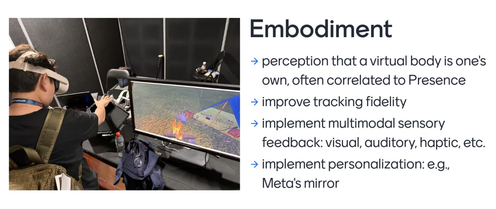

## Mentimeter

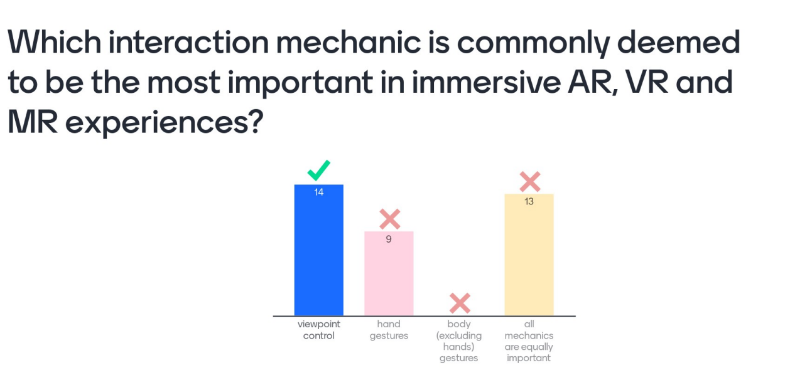
### Question 2

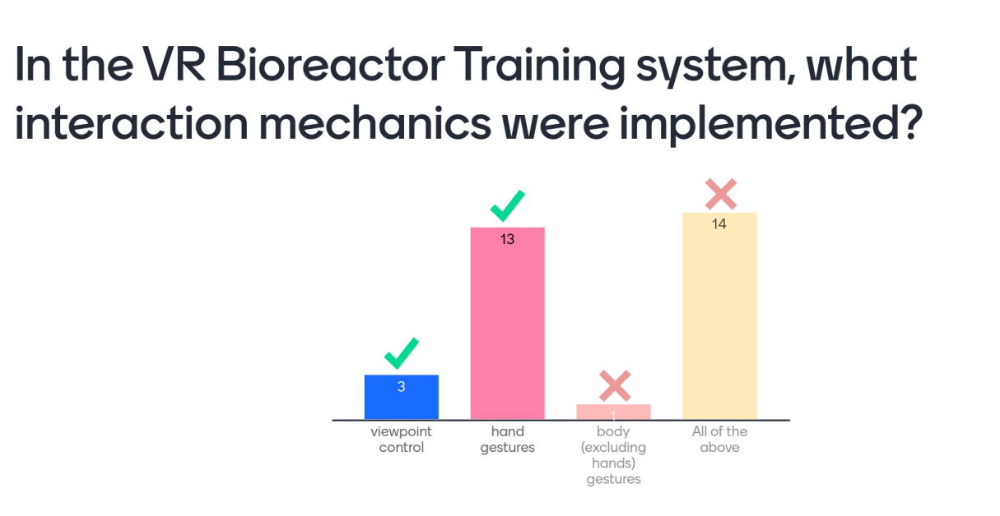
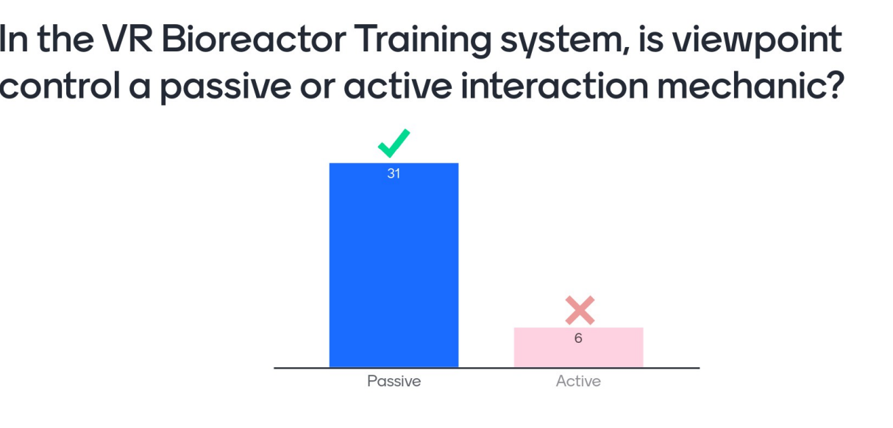
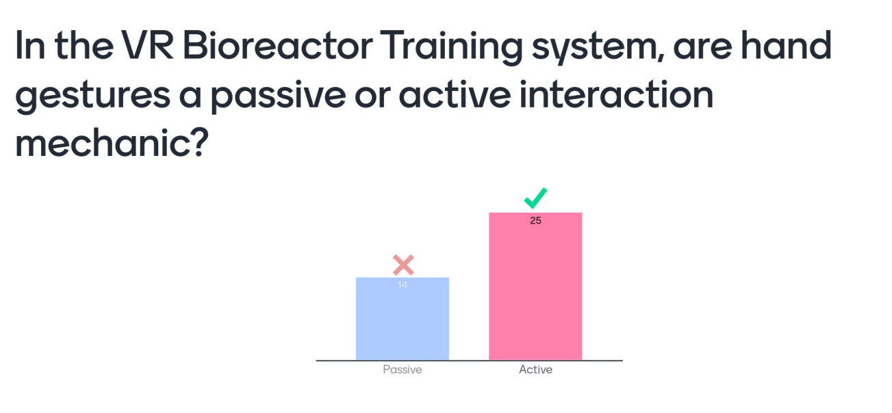

### Question 3

### Question 4
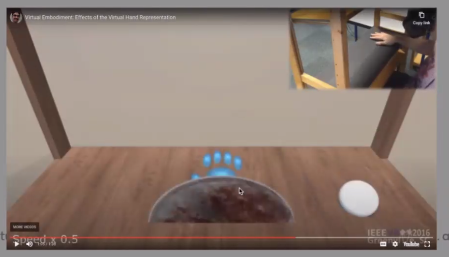
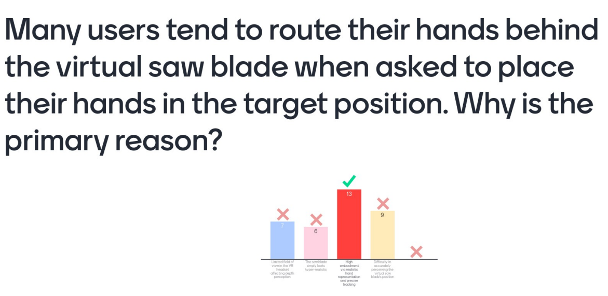
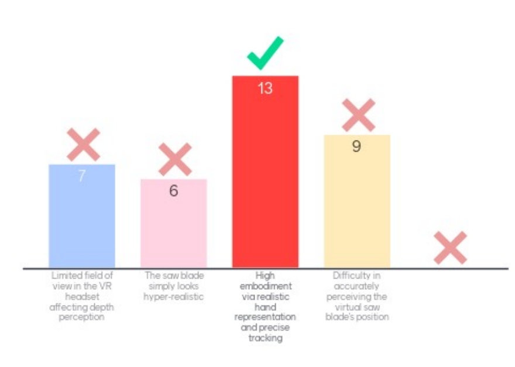

### Question 5

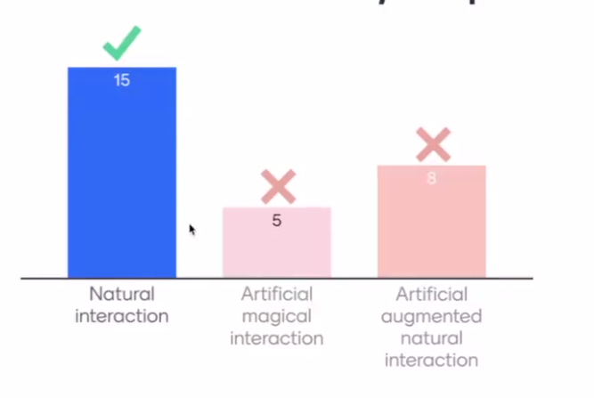

### Question 6

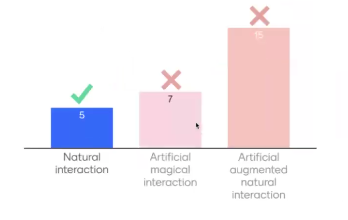

### Question 7
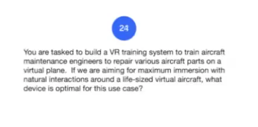

### Question 8
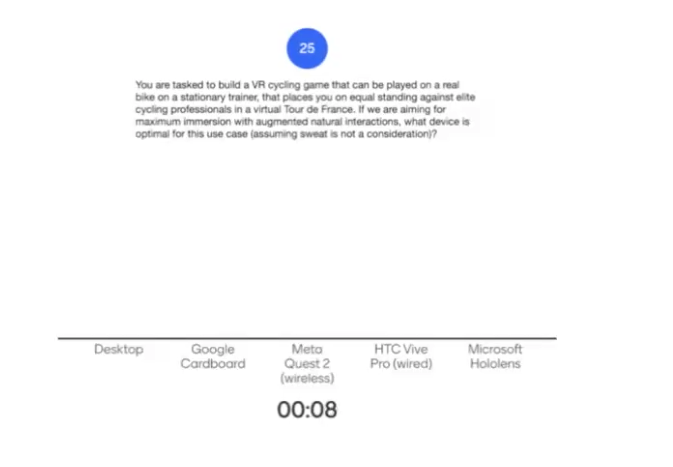
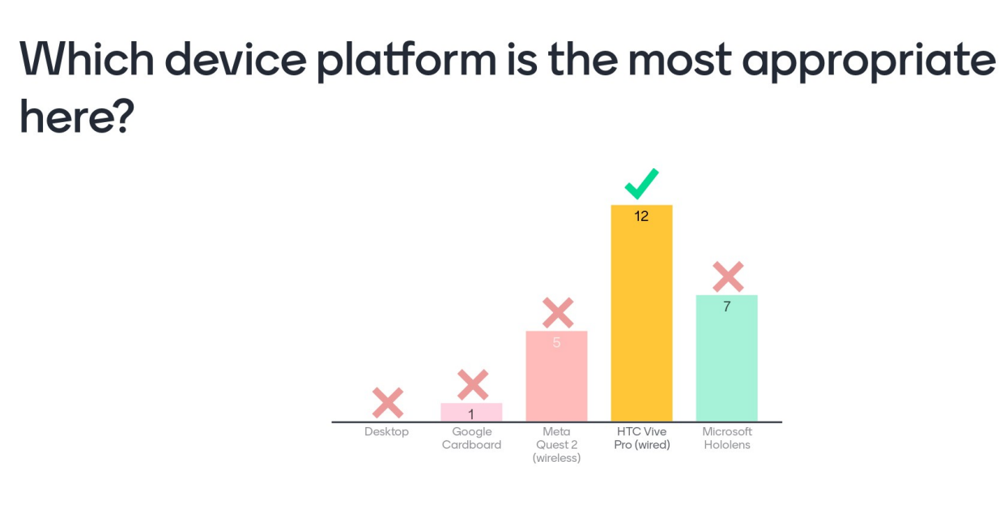

### Question 9
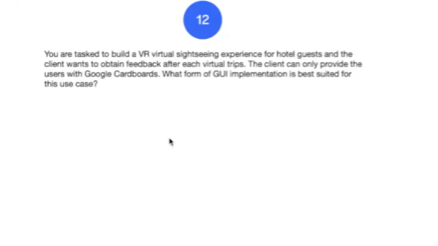
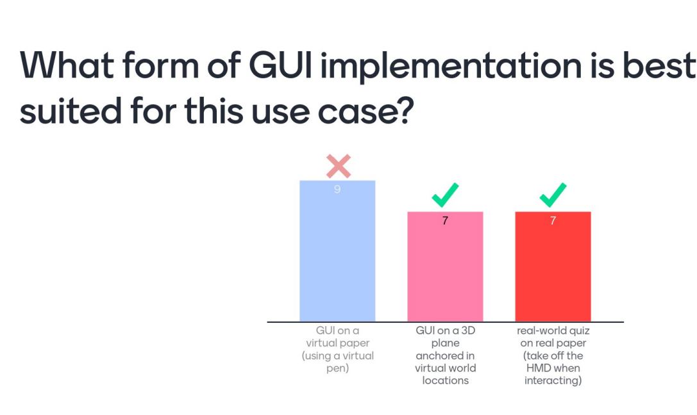

### Question 10
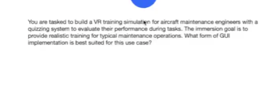
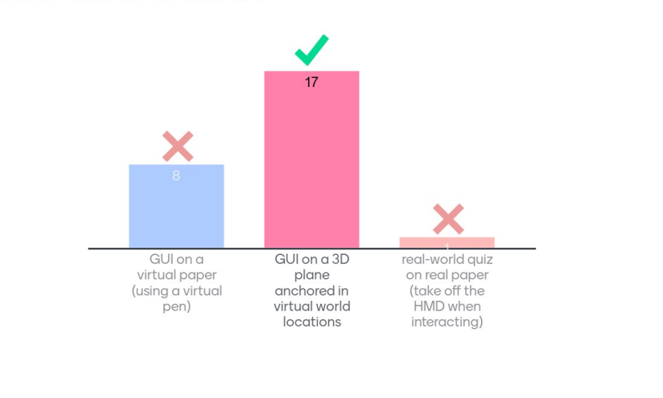

### Question 11
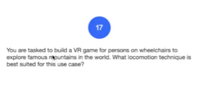

### Question 12

### Question 13

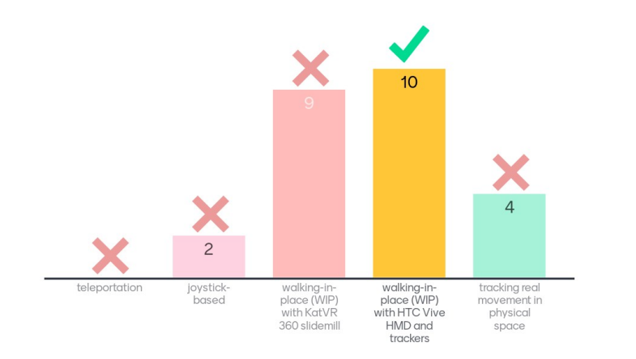
